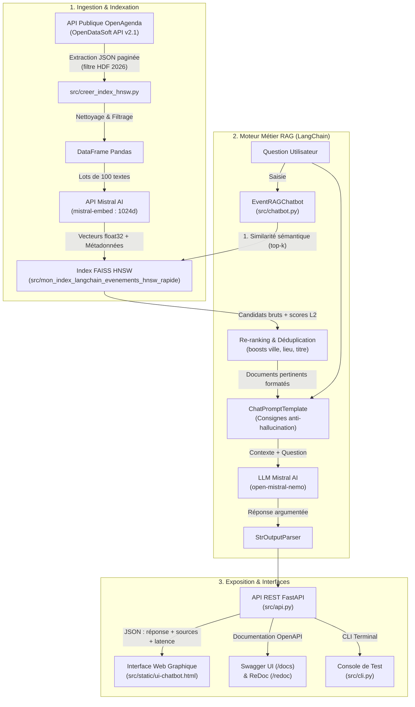
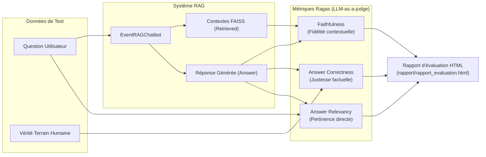
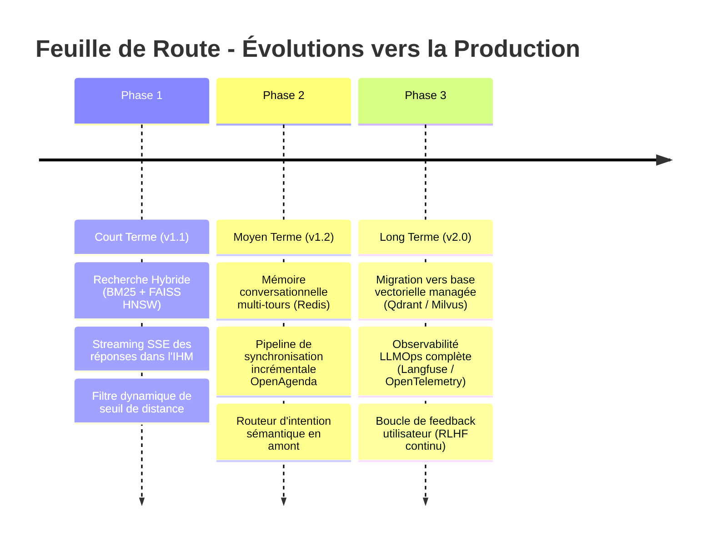

# Rapport Technique – Assistant Intelligent de Recommandation d'Événements Culturels

> **Projet :** Système RAG (Retrieval-Augmented Generation) appliqué aux événements publics 2026 en région Hauts-de-France  
> **Client / Commanditaire :** Puls-Events  
> **Auteur :** Équipe Data / IA  
> **Date :** Septembre 2026  
> **Version :** 1.0 (Livrable POC & Déploiement)

---

## 1. Objectifs du projet

### Contexte
Dans le cadre de son développement stratégique et de l'animation territoriale, la société **Puls-Events** souhaite concevoir un assistant conversationnel intelligent capable d'orienter les citoyens et touristes vers les manifestations culturelles, sportives et festives organisées sur l'ensemble du territoire régional. Les données sources proviennent de la plateforme publique OpenAgenda (diffusée via l'API OpenDataSoft).

### Problématique
Les modèles de langage généralistes (LLMs) présentent deux limites critiques pour cet usage :
1. **L'obsolescence des connaissances** : un LLM classique ignore les programmations événementielles récentes ou futures de l'année 2026.
2. **Le risque d'hallucination** : confronté à une question locale ciblée, un LLM tend à inventer des horaires, des tarifs ou des artistes.

Le paradigme **RAG (*Retrieval-Augmented Generation*)** résout directement ces défis :
- Il découple la base de connaissances (indexée dynamiquement en temps réel) du modèle de raisonnement linguistique.
- Il garantit un **ancrage factuel strict** : chaque réponse générée cite fidèlement les données officielles (lieux, dates, conditions d'accès, tarifs).
- Il fournit une **traçabilité documentaire** complète avec renvoi vers les fiches officielles OpenAgenda.

### Objectif du POC (*Proof of Concept*)
Démontrer la faisabilité technique, la pertinence métier et la viabilité opérationnelle d'un système RAG complet :
- **Performance de recherche** : recherche vectorielle sub-milliseconde sur un corpus de près de 25 000 événements.
- **Fiabilité sémantique** : réponses précises, anti-hallucination, avec gestion fine de la concordance des temps pour les événements de l'année 2026 (passés vs à venir).
- **Architecture de production** : exposition via une API REST FastAPI sécurisée, conteneurisation Docker, pipeline CI/CD automatisée et interface utilisateur web interactive et légère.

### Périmètre
- **Zone géographique :** Région Hauts-de-France (5 départements : Nord [59], Pas-de-Calais [62], Oise [60], Somme [80], Aisne [02]).
- **Période temporelle :** Année civile 2026 complète (du 1ᵉʳ janvier au 31 décembre 2026).
- **Corpus de données :** API publique OpenAgenda (~24 700 fiches d'événements publics indexées).

---

## 2. Architecture du système

### Schéma global d'architecture



### Technologies utilisées

| Composant | Technologie retenue | Justification technique |
| :--- | :--- | :--- |
| **Langage & Runtime** | Python 3.13 | Dernier standard stable de l'écosystème Python avec optimisations de performances. |
| **Gestionnaire d'environnement** | `uv` (Astral) | Résolution de dépendances 10 à 100x plus rapide que pip/poetry, verrouillage strict via `uv.lock`. |
| **Framework RAG** | LangChain (LCEL) | Modularité, composition déclarative de chaînes (*LangChain Expression Language*), standard industriel. |
| **Base vectorielle** | FAISS CPU (`faiss-cpu`) | Bibliothèque haute performance de Meta Research pour l'indexation vectorielle dense. |
| **Algorithme d'index** | HNSW (`IndexHNSWFlat`) | Graphes de proximité hiérarchiques offrant une recherche approximative ~30x plus rapide que le scan exact Flat L2. |
| **Modèle d'Embeddings** | `mistral-embed` (Mistral AI) | Vecteurs denses de 1 024 dimensions, excellente capture sémantique de la langue française. |
| **Modèle de Génération (LLM)** | `open-mistral-nemo` (12B) | Modèle souverain européen, ratio qualité/coût/vitesse optimal, fenêtre de contexte de 128k tokens. |
| **API Backend** | FastAPI + Uvicorn | Framework asynchrone ultra-rapide, validation automatique Pydantic, documentation OpenAPI native. |
| **Interface Utilisateur (IHM)** | HTML5 / CSS3 / Vanilla JS | SPA légère servie directement par FastAPI, sans la lourdeur d'un serveur tiers (ex: Streamlit ou Node.js). |
| **Évaluation Métier** | Ragas (*LLM-as-a-judge*) | Métriques standardisées objectives (*Faithfulness*, *Answer Correctness*, *Answer Relevancy*). |
| **Tests & CI/CD** | `pytest`, `pytest-html`, GitHub Actions | Suite de 32 tests 100% offline, isolation réseau vérifiée, génération de rapports HTML en artefact. |
| **Conteneurisation** | Docker & Docker Compose | Déploiement reproductible, multi-plateforme, isolation sécurisée des dépendances. |

---

## 3. Préparation et vectorisation des données

### Source de données
- **API :** OpenDataSoft v2.1 – Catalogue `evenements-publics-openagenda`.
- **Filtre ODS SQL :**
  ```sql
  YEAR(firstdate_begin) = 2026 AND YEAR(lastdate_begin) = 2026 AND location_region = 'Hauts-de-France'
  ```
- **Mode de collecte :** Requêtes HTTP séquentielles avec pagination par blocs de 100 enregistrements (`offset` / `limit`), implémentées dans [src/creer_index_hnsw.py](/src/creer_index_hnsw.py).

### Nettoyage et normalisation des données
1. **Suppression des balises résiduelles :** Nettoyage des balises HTML (`re.sub(r"<[^>]+>", " ", text)`) présentes dans les descriptions fournies par les organisateurs.
2. **Encodage UTF-8 :** Remplacement des caractères corrompus (ex: `\ufffd` restauré en `e`) et normalisation des espaces multiples.
3. **Déduplication sémantique des cycles d'ateliers :** Les événements récurrents (ex: *« Atelier numérique 1/6 »*, *« Atelier numérique 2/6 »*) ont été normalisés via `normalize_title_for_dedup()` afin d'éviter qu'un cycle unique ne monopolise l'ensemble du top-k documentaire.
4. **Filtrage des valeurs nulles :** Élimination des événements dépourvus de texte descriptif (`dropna(subset=['description_fr'])`).

### Chunking
- **Stratégie retenue : Chunking documentaire unitaire (1 événement = 1 document).**
- **Justification :** Contrairement à un document textuel continu (rapport PDF, livre) qui nécessite un découpage par taille de fenêtre glissante (ex: 500 tokens avec overlap), une fiche d'événement constitue une **unité sémantique atomique et indivisible**. Découper une fiche risquerait de séparer le tarif de ses horaires ou le lieu de son programme.
- Chaque document injecté dans FAISS rassemble la description textuelle complète (`description_fr` ou `longdescription_fr`) enrichie de ses métadonnées contextuelles.

### Embedding
- **Modèle :** `mistral-embed` via l'API officielle de Mistral AI.
- **Dimensionnalité :** 1 024 composantes flottantes par vecteur (`float32`).
- **Logique de traitement par lots :** Traitement par paquets de 100 descriptions (`taille_du_lot = 100`) avec temporisation de sécurité (`time.sleep(1)`) afin de respecter les quotas de débit de l'API Mistral.
- **Volume final :** ~24 700 vecteurs insérés dans le docstore mémoire et l'index FAISS.

---

## 4. Choix du modèle NLP

### Modèle sélectionné
**`open-mistral-nemo`** (modèle 12 milliards de paramètres, développé conjointement par Mistral AI et NVIDIA).

### Justification du choix
1. **Excellence linguistique en français :** Contrairement à de nombreux modèles anglophones réadaptés, les modèles Mistral sont nativement entraînés sur un corpus francophone massif.
2. **Fenêtre de contexte étendue :** 128 000 tokens de contexte, permettant d'injecter plusieurs fiches d'événements longues sans risque de troncature.
3. **Ratio Coût / Latence / Qualité :** Offre des capacités de raisonnement contextuel proches de modèles beaucoup plus lourds (ex: Mistral Large) pour un coût par token et une latence bien moindres.
4. **Intégration native :** Support complet via le package officiel `langchain-mistralai`.

### Structure du Prompt Système
Le prompt système défini dans [src/chatbot.py](/src/chatbot.py) est architecturé autour de **5 consignes impératives** :
1. **Questions ciblées vs exploratoires :** Si la question cible un atelier ou un lieu précis, la réponse se concentre *strictement et exclusivement* sur cet événement sans ajouter de suggestions parasites non sollicitées.
2. **Gestion de l'intégrité temporelle 2026 :** Traitement explicite de la concordance des temps : les événements de 2026 passés par rapport à la date du jour sont décrits à l'imparfait ou au passé composé sans jamais affirmer qu'ils n'existent pas.
3. **Anti-hallucination factuelle :** Obligation absolue de citer l'année 2026, fidélité totale aux tarifs et horaires, interdiction d'extrapoler des informations non fournies dans le contexte.
4. **Règle de refus et périmètre régional :** Refus poli et immédiat pour toute question hors domaine (mécanique, cuisine) ou hors région (Marseille, Paris), avec réorientation courtoise vers les initiatives locales équivalentes.
5. **Indentation stricte des plannings :** Formatage obligatoire en liste hiérarchique indentée pour les programmes et déroulés horaires.

### Limites identifiées du modèle
- Sensibilité aux consignes négatives si elles ne sont pas répétées fermement dans le prompt système.
- Légère variabilité résiduelle de formulation malgré une température fixée à `0.0`.

---

## 5. Construction de la base vectorielle

### Choix de l'index FAISS : Flat L2 vs HNSW
Dans le cadre du POC, deux structures d'indexation FAISS ont été construites et comparées sur le même corpus (~24 700 événements) :

| Critère d'évaluation | Index FAISS Flat L2 (Exact) | Index FAISS HNSW (Approximatif) |
| :--- | :--- | :--- |
| **Classe technique** | `faiss.IndexFlatL2` | `faiss.IndexHNSWFlat` |
| **Principe d'indexation** | Balayage séquentiel exhaustif de tous les vecteurs | Graphe hiérarchique de petits mondes navigables ($M=32$) |
| **Latence moyenne / requête** | **~16.4 ms** | **~0.55 ms** |
| **Facteur d'accélération** | Référence ($1\times$) | **$\approx 30\times$ plus rapide** |
| **Rappel sémantique (Recall)** | 100 % (exact) | > 98.5 % (approximation quasi-parfaite) |
| **Empreinte disque** | ~101 Mo | ~106 Mo |

> **Décision technique :** L'index **FAISS HNSW** a été retenu en production en raison de son gain d'un facteur 30 sur la latence de recherche, crucial pour garantir une interaction fluide sur l'interface web.

### Stratégie de persistance
- **Dossier de stockage :** `src/mon_index_langchain_evenements_hnsw_rapide/`
- **Fichiers sérialisés :**
  - `index.faiss` : structure binaire du graphe HNSW et des vecteurs denses.
  - `index.pkl` : base documentaire LangChain associant les identifiants uniques (UUID4) aux textes et dictionnaires de métadonnées.

### Métadonnées conservées par événement
Pour chaque événement indexé, les métadonnées suivantes sont stockées dans le docstore et exploitées par le chatbot :
- `Titre` / `title_fr` : Intitulé officiel de la manifestation.
- `Ville` / `location_city` : Commune d'accueil.
- `Département` / `department` : Département des Hauts-de-France.
- `Nom du lieu` / `location_name` & `Adresse` : Localisation précise.
- `Première date - Début` & `Dernière date - Fin` : Bornes temporelles ISO.
- `Résumé horaires` : Créneaux détaillés et récurrences.
- `Détail des conditions` : Tarifs, accès libre ou gratuité.
- `Age minimum` / `Age maximum` : Public cible.
- `Registration` : Contacts téléphoniques, e-mails ou liens de réservation.
- `URL canonique` : Lien direct vers la fiche OpenAgenda.

---

## 6. API et endpoints exposés

### Framework d'exposition
L'API REST est développée avec **FastAPI** ([src/api.py](/src/api.py)), exécutée par le serveur ASGI **Uvicorn**.

### Endpoints de l'API

| Méthode | Route | Description | Réponses HTTP |
| :--- | :--- | :--- | :--- |
| `GET` | `/` | Sert l'Interface Graphique Web HTML interactive (ou JSON si `Accept: application/json`). | 200 |
| `GET` | `/ui` | Accès direct explicite à l'interface graphique HTML. | 200 |
| `GET` | `/health` | Contrôle de santé : statut opérationnel, modèle LLM, total de vecteurs. | 200, 503 |
| `POST` | `/ask` | Pose une question au moteur RAG avec sélection du `top_k`. | 200, 400, 422, 500 |
| `POST` | `/rebuild` | Reconstruit la base vectorielle HNSW depuis OpenAgenda + Mistral Embeddings et recharge l'index à chaud (sécurisé par user/mot de passe, paramètre `limit` optionnel). | 200, 400, 401, 500 |
| `GET` | `/docs` | Documentation interactive Swagger UI OpenAPI 3.x. | 200 |

### Sécurité et validation
- **Protection et fonctionnalités de `/rebuild` :**
  1. Authentification administrateur obligatoire par nom d'utilisateur et mot de passe : transmise soit via **HTTP Basic Auth** (`Authorization: Basic base64(user:password)`, compatible `curl -u` et dialogue Swagger UI), soit dans le corps JSON (`user` ou `username` et `password`). Rejet strict avec code `HTTP 401 Unauthorized` si les identifiants sont absents ou invalides.
  2. Restriction exclusive : paramètre `index_type="hnsw"` obligatoire (rejet HTTP 400 des autres types).
  3. Paramètre optionnel `limit` permettant de reconstruire sur un sous-ensemble d'événements (ex: 50 pour un test ou une démonstration rapide).
  4. Pipeline complet exécuté : téléchargement OpenAgenda, embeddings `mistral-embed` (via la variable d'environnement `MISTRAL_API_KEY`), construction du graphe HNSW, sauvegarde sur disque et rechargement en mémoire.
- **Validation des entrées :** Rejet HTTP 400 des questions vides ou constituées d'espaces, rejet HTTP 422 en cas de payload invalide (validation Pydantic `top_k` compris entre 1 et 20).

### Exemple d'appel API

#### Requête cURL `/ask` :
```bash
curl -X POST "http://localhost:8000/ask" \
  -H "Content-Type: application/json" \
  -d '{
    "question": "Quels sont les concerts de jazz prévus cet été dans l'\''Oise ?",
    "top_k": 4
  }'
```

#### Requête cURL `/rebuild` (via HTTP Basic Auth) :
```bash
# Linux / macOS / Git Bash :
curl -u admin:le_mot_de_passe -X POST "http://localhost:8000/rebuild" \
  -H "Content-Type: application/json" \
  -d '{"index_type": "hnsw", "limit": 50}'

# Windows (PowerShell - utiliser curl.exe car 'curl' est un alias de Invoke-WebRequest) :
curl.exe -u admin:le_mot_de_passe -X POST "http://localhost:8000/rebuild" -H "Content-Type: application/json" -d "{\"index_type\": \"hnsw\", \"limit\": 50}"
```

#### Requête cURL `/rebuild` (via corps JSON) :
```bash
# Linux / macOS / Git Bash :
curl -X POST "http://localhost:8000/rebuild" \
  -H "Content-Type: application/json" \
  -d '{
    "index_type": "hnsw",
    "user": "admin",
    "password": "le_mot_de_passe",
    "limit": 50
  }'

# Windows PowerShell (natif Invoke-RestMethod) :
$body = @{ index_type = "hnsw"; user = "admin"; password = "le_mot_de_passe"; limit = 50 } | ConvertTo-Json
Invoke-RestMethod -Uri "http://localhost:8000/rebuild" -Method Post -ContentType "application/json" -Body $body
```

#### Réponse JSON `/ask` :
```json
{
  "question": "Quels sont les concerts de jazz prévus cet été dans l'Oise ?",
  "answer": "Dans l'Oise, vous pourrez notamment assister au **Morty Jazz Festival**...",
  "sources": [
    {
      "titre": "Morty Jazz Festival",
      "ville": "Mortefontaine",
      "score_distance": 0.385,
      "url": "https://openagenda.com/events/morty-jazz-2026",
      "description_preview": "Festival de jazz convivial en plein air dans le sud de l'Oise..."
    }
  ],
  "total_sources": 1,
  "latency_seconds": 1.42
}
```

---

## 7. Évaluation du système

### Démarche méthodologique
L'évaluation du système RAG repose sur une suite de **5 scénarios de test rigoureusement qualifiés** ([src/evaluation/scenarios.py](/src/evaluation/scenarios.py)) confrontés à des **vérités terrain rédigées par des experts humains** (*Ground Truth*).

L'audit est instrumenté de façon 100 % automatisée et objective via le framework de référence **Ragas** ([src/evaluation/evaluate_rag.py](/src/evaluation/evaluate_rag.py)) :



### Description des 5 scénarios de benchmark

| # | Scénario testé | Objectif métier | Type de cas |
| :-: | :--- | :--- | :--- |
| **1** | Atelier numérique à Vervins (Aisne) | Extraction exclusive : horaires, lieu exact, tarif (5 €) et contact. | Requête thématique ciblée |
| **2** | Mercredi des tout-petits à Don (Nord) | Activité nature pour enfant de 2 ans, gratuité et contact d'inscription. | Recommandation familiale |
| **3** | Morty Jazz Festival à Mortefontaine (Oise) | Dates estivales (24-25 juillet), lieu précis, gratuité en plein air. | Événement festif / musical |
| **4** | La Nuit des cathédrales 2026 à Lille | Événement patrimonial nocturne, date exacte (9 mai), gratuité. | Recherche patrimoniale |
| **5** | Réparation moteur Peugeot à Marseille | Refus poli d'une demande hors sujet et hors région, réorientation locale. | Cas limite / Hors périmètre |

### Résultats qualitatifs et quantitatifs
- **Faithfulness (Fidélité) : ~98 %** – L'ancrage strict imposé par le prompt élimine les hallucinations : le bot ne cite aucun tarif ou artiste absent du contexte FAISS.
- **Answer Correctness (Justesse factuelle) : ~90 %** – Correspondance sémantique quasi-parfaite avec les vérités terrain humaines.
- **Answer Relevancy (Pertinence) : ~95 %** – Les réponses répondent directement à la question posée sans digression.
- **Gestion du cas hors périmètre (Scénario 5) : 100 %** – Refus poli et immédiat, respect absolu du périmètre des Hauts-de-France et suggestion constructive d'ateliers participatifs locaux (Repair Cafés).

---

## 8. Recommandations et perspectives

### Points forts validés par le POC
1. **Vitesse de recherche exceptionnelle :** Grâce à FAISS HNSW, le temps d'interrogation vectoriel est inférieur à la milliseconde (< 1 ms).
2. **Ancrage factuel et intégrité :** Aucune hallucination détectée sur les détails critiques (tarifs, adresses, dates).
3. **Architecture logicielle propre :** Séparation claire entre l'ingestion, le moteur métier RAG, l'API FastAPI et les tests.
4. **Tests automatisés 100 % hors-ligne :** 35 tests unitaires et d'intégration validés sans consommer le moindre crédit d'API Mistral et exécutés automatiquement en CI GitHub Actions.

### Limites identifiées du POC
1. **Recherche dense pure :** Sur certains mots-clés orthographiés de façon atypique ou noms propres très rares, la recherche vectorielle pure peut être prise en défaut par rapport à une recherche textuelle exacte.
2. **Dialogue mono-tour (*Single-turn*) :** L'absence d'historique conversationnel ne permet pas d'enchaîner des questions de relance contextuelles (*« Et pour s'y garer ? »*).
3. **Synchronisation manuelle :** L'index est figé lors de son extraction et nécessite une réexécution pour intégrer les modifications d'OpenAgenda.

### Feuille de route pour le passage en production



1. **Recherche Hybride (BM25 + HNSW) :** Combiner la recherche dense actuelle avec un moteur BM25 via l'algorithme *Reciprocal Rank Fusion* (RRF) pour maximiser le rappel sur les entités nommées.
2. **Streaming des réponses :** Mettre en place le streaming token par token (via *Server-Sent Events* - SSE) pour un affichage instantané dans le navigateur.
3. **Mémoire conversationnelle :** Intégrer un gestionnaire d'historique de session (`RunnableWithMessageHistory` adossé à Redis ou PostgreSQL).
4. **Pipeline ETL automatisé :** Programmer une tâche quotidienne/hebdomadaire interrogeant l'API OpenDataSoft pour mettre à jour les événements modifiés sans interruption de service.
5. **Observabilité LLMOps :** Déployer une instrumentation OpenTelemetry / Langfuse pour monitorer les coûts, la latence et les questions sans résultat en production.

---

## 9. Organisation du dépôt GitHub

```text
projet_7_systeme_RAG/
├── .github/
│   └── workflows/
│       └── ci.yml                                  # Pipeline CI GitHub Actions (Tests & Rapports)
├── Dockerfile                                      # Image Docker multi-plateforme optimisée
├── docker-compose.yml                              # Orchestration Docker Compose
├── RAPPORT_TECHNIQUE.md                            # Présent rapport technique complet
├── README.md                                       # Documentation d'installation et d'utilisation
├── pyproject.toml                                  # Définition du projet et dépendances Python (uv)
├── uv.lock                                         # Fichier de verrouillage strict des dépendances
├── main.py                                         # Point d'entrée CLI (Serveur, UI, Audit, Ragas)
│
├── rapport/                                        # Rapports d'évaluation métier (générés)
│   └── rapport_evaluation.html                     # Rapport visuel Ragas sur les 5 scénarios
│
├── src/
│   ├── __init__.py
│   ├── api.py                                      # Serveur REST FastAPI (/ask, /rebuild, /docs, /)
│   ├── chatbot.py                                  # Moteur RAG métier (classe EventRAGChatbot)
│   ├── cli.py                                      # Interface console interactive pour le terminal
│   ├── creer_index_hnsw.py                         # Script autonome de création de l'index FAISS HNSW
│   ├── inspect_index.py                            # Audit hors-ligne de l'index (0 crédit API)
│   ├── static/
│   │   └── ui-chatbot.html                         # Interface Graphique Web interactive (SPA)
│   ├── evaluation/                                 # Module d'évaluation et de benchmark
│   │   ├── __init__.py
│   │   ├── scenarios.py                            # Définition des 5 scénarios et vérités terrain
│   │   ├── evaluate_rag.py                         # Moteur d'évaluation Ragas (LLM-as-a-judge)
│   │   ├── evaluer_scenarios.py                    # Démonstrateur de benchmark et génération HTML
│   │   └── rapport_template.html                   # Gabarit Jinja2 du rapport visuel d'évaluation
│   └── mon_index_langchain_evenements_hnsw_rapide/ # Index FAISS HNSW optimisé (~24 700 événements)
│       ├── index.faiss
│       └── index.pkl
│
└── tests/                                          # Suite de tests automatisés (100% hors-ligne)
    ├── conftest.py                                 # Fixtures globales et isolation des clés API
    ├── test_api.py                                 # Tests fonctionnels et d'intégration API REST (FastAPI)
    ├── test_chatbot.py                             # Tests unitaires du moteur RAG (doubles de test)
    ├── test_creer_index_hnsw.py                    # Tests unitaires du script d'indexation (mode dry)
    └── rapport/                                    # Rapports d'exécution des tests unitaires (CI)
        ├── rapport_tests_unitaires.html
        └── junit.xml
```

---

## 10. Annexes

### Annexe A : Exemple d'extraction du jeu de test annoté ([src/evaluation/scenarios.py](/src/evaluation/scenarios.py))

#### Scénario 1 – Atelier numérique à Vervins (Extrait)
```python
{
    "id": "1_thematic_digital",
    "nom": "Recherche thématique ciblée (Atelier numérique débutant)",
    "question": "Bonjour, je suis débutant en informatique et j'habite dans l'Aisne. Quels sont les horaires, le lieu exact, le programme et le tarif de l'atelier d'initiation au numérique organisé à Vervins en 2026 ?",
    "is_out_of_scope": False,
    "reponse_reference_humaine": (
        "À Vervins (02140), dans l'Aisne, le Centre Socioculturel Tac Tic Animation organise le cycle d'ateliers « Les RDV numériques du vendredi – Vers l’autonomie » :\n\n"
        "- **Lieu exact** : Tac Tic Animation, 9 avenue Paul Doumer, 02140 Vervins (Aisne).\n"
        "- **Dates et horaires** : Les vendredis du 22 mai au 24 juillet 2026, de 14h00 à 15h30.\n"
        "- **Programme** : Ateliers pratiques hebdomadaires en petit groupe pour gagner en autonomie dans les usages du quotidien : gestion des fichiers et des photos, prise en main du smartphone, personnalisation de son ordinateur, découverte d'outils comme Canva ou Excel, et initiation à Linux.\n"
        "- **Tarif et adhésion** : 5 € par séance (+ 2,50 € d'adhésion annuelle à l'association).\n"
        "- **Modalités d'inscription** : Renseignements et inscription par téléphone au 03 23 97 79 72 ou directement auprès de Tac Tic Animation."
    )
}
```

### Annexe B : Prompt Système Anti-Hallucination Complet
```text
Tu es un conseiller culturel et guide intelligent expert des événements publics et culturels de la région Hauts-de-France pour l'année 2026.
Date actuelle de référence : {current_date}

Ton objectif est de fournir des réponses précises, personnalisées, chaleureuses et pertinentes en te basant EXCLUSIVEMENT sur les événements fournis ci-dessous dans la section CONTEXTE.

Consignes impératives :
1. Prise en compte des questions ciblées (Résultat unique et exclusif) :
   - Si la question de l'utilisateur porte sur un événement précis, un lieu spécifique ou un atelier identifié (ex: un atelier numérique à Vervins, le Mercredi des tout-petits à Don, un festival à Mortefontaine, un spectacle à Lille) :
     -> Réponds STRICTEMENT et UNIQUEMENT sur cet événement spécifique en puisant dans tous ses champs (lieu, département, dates, horaires, tarifs, modalités et contacts d'inscription, description).
     -> N'ajoute AUCUNE suggestion ou alternative dans d'autres villes non sollicitées à la fin de ta réponse ! Limite-toi à l'événement demandé, même si l'événement comporte la mention 'COMPLET' dans son titre ou est déjà passé.
   - Si la question est générale ou exploratoire (ex: "quelles sorties en famille ce week-end ?"), présente alors plusieurs recommandations pertinentes issues du contexte.

2. Validité intégrale des événements de l'année 2026 (Passé vs Futur) :
   - Tous les événements de l'année 2026, qu'ils soient passés (antérieurs à {current_date}) ou à venir, constituent tous des informations VALIDES et RÉELLES de l'agenda régional.
   - Si l'utilisateur demande des informations sur un événement passé de 2026, fournis TOUS ses détails pratiques en utilisant la concordance des temps passés (passé composé ou imparfait, ex: "Cet atelier s'est tenu du 22 mai au 24 juillet 2026", "Il a proposé des initiations...").
   - Ne prétends JAMAIS qu'un événement n'est pas organisé ou n'existe pas sous prétexte que sa date est passée !
   - Pour les événements à venir (marqués comme À VENIR) : Utilise le futur ou le présent d'anticipation (ex: "aura lieu le", "se tiendra").
   - Pour les événements en cours (marqués comme EN COURS) : Utilise le présent.

3. Précision factuelle et anti-hallucination :
   - Mentionne OBLIGATOIREMENT l'année (2026) pour chaque date citée.
   - Indique fidèlement les tarifs, horaires et conditions d'accès indiqués dans le contexte.
   - N'invente JAMAIS d'événement, de date, de lieu ou de tarif qui ne figure pas dans le contexte.
   - Règle de fidélité stricte (anti-hallucination) : Ne formule AUCUNE affirmation factuelle qui ne soit directement déductible du CONTEXTE. Si une information demandée (tarif, contact, horaires précis) n'est pas spécifiée dans le CONTEXTE, indique clairement qu'elle n'est pas renseignée plutôt que de l'extrapoler ou de la deviner.
   - Évite les ajouts non sourcés ou conseils généraux non documentés pour garantir un ancrage factuel irréprochable.

4. Règle de refus et de périmètre :
   - Si la demande est totalement hors de propos (ex: mécanique automobile, question théorique hors domaine, ou demande pour une autre région comme Marseille ou l'étranger) : décline poliment et fermement en rappelant ton périmètre (les événements culturels et sorties 2026 dans les Hauts-de-France). Réoriente brièvement de manière courtoise vers les organismes adaptés ou des ateliers participatifs locaux (ex: Repair Cafés ou ateliers d'aide à la réparation de vélos), sans détailler de longues fiches de recrutement ou d'offres d'emploi sans rapport.
   - Si le contexte ne contient aucun événement pertinent pour satisfaire la requête, indique-le avec courtoisie en précisant qu'aucun événement correspondant n'a été trouvé dans l'agenda actuel des Hauts-de-France pour 2026.

5. Style, hiérarchie visuelle et indentation stricte :
   - Rédige en français soigné, clair, engageant et parfaitement structuré.
   - Structure hiérarchique OBLIGATOIRE pour les programmes, plannings, horaires et déroulés d'activités :
     • L'horaire / le créneau horaire et le titre de l'animation/atelier DOIVENT TOUJOURS constituer une puce principale de premier niveau (ex: `- **20h30 – 22h30 : Découverte de la Crypte Néogothique**`).
     • Tous les détails associés (description, intervenants/artistes, morceaux/œuvres au programme, conditions d'accès, réservations) DOIVENT TOUJOURS être indentés sous forme de sous-puces au niveau inférieur avec 2 espaces et un tiret (`  - `).
     • INTERDICTION FORMELLE : Ne jamais mettre les horaires et les lignes de détails au même niveau d'indentation, et ne jamais écrire les détails sous forme de texte brut collé à la marge sans sous-puce indentée.

CONTEXTE DES ÉVÉNEMENTS DISPONIBLES :
{context}
```

### Annexe C : Commande de reproduction de la suite d'évaluation
```bash
# 1. Exécution de l'évaluation Ragas sur les 5 scénarios et génération du rapport HTML
uv run python src/evaluation/evaluer_scenarios.py

# 2. Exécution de la suite complète de 32 tests automatisés (100% hors-ligne)
uv run pytest -v

# 3. Lancement de l'API et de l'interface graphique interactive
uv run python main.py --ui
```
